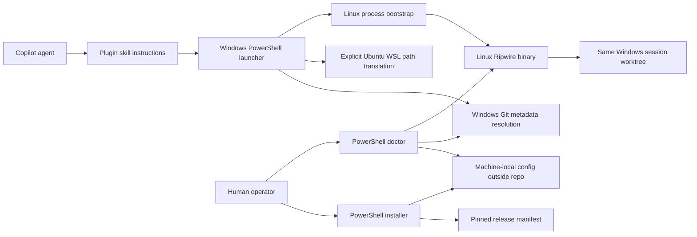

# Ripwire WSL Toolkit Work Shaping

## Problem Statement

Windows-hosted coding agents need Ripwire's Linux analysis capabilities without moving edits,
builds, tests, or Git mutations into Linux and without creating a second clone that can drift from
the active session. The toolkit must make the current Windows worktree the one source tree seen by
both Windows tools and Ripwire in Ubuntu WSL.

The difficult case is a Windows-created linked worktree. Its `.git` file contains a Windows path
that Linux Git does not interpret as an absolute path. A portable launcher must resolve Git metadata
with Windows Git, translate it for WSL, and scope the translated metadata to one Ripwire process.

## Settled Scope

### Core functionality

- Package the capability as an installable skill in this repository's existing
  `brownch-devtools` plugin.
- Provide a stable Windows CLI launcher whose required repository input is the current worktree.
- Run the upstream Linux Ripwire release in an explicitly selected Ubuntu WSL distribution.
- Resolve and translate worktree, Git directory, and common metadata without rewriting `.git`.
- Preserve caller Git configuration overrides and append a process-local
  `core.fsmonitor=false` override.
- Admit only a reviewed, closed set of `v0.5.0` analysis options; reject alternate roots, MCP,
  cache/output generation, baseline, and editing controls before WSL starts.
- Install a pinned upstream release from checksummed assets.
- Diagnose prerequisites and configuration without silently enabling Windows features, replacing a
  distribution, or modifying host MCP configuration.
- Teach agents when and how to use the launcher for analysis while keeping edits and verification on
  Windows.
- Add regression coverage using this repository's standalone PowerShell test style.

### Explicitly deferred or excluded

- A native Windows port of Ripwire.
- A second project clone inside WSL.
- Host-global or user-global MCP configuration.
- An MCP protocol path adapter.
- Claims that Ripwire is read-only or that a positional MCP root is a universal sandbox.
- Support for one Ripwire process spanning multiple worktrees or arbitrary temporary repositories.
- Hardcoded usernames, checkout paths, branches, Git metadata paths, or local distribution choices.

## Expected User Flow

1. A human installs the Copilot plugin through the repository's normal plugin distribution.
2. A human runs the skill's installer, explicitly selecting an installed Ubuntu distribution when
   local configuration does not already exist.
3. The installer verifies prerequisites, downloads the pinned architecture-specific release,
   verifies its checksum, installs it inside WSL, and records only machine-local settings outside
   the repository.
4. An agent invokes the launcher with the current Windows worktree and a Ripwire CLI analysis
   request.
5. The launcher resolves Windows Git metadata, translates paths, starts one WSL process with
   process-local Git environment, and returns Ripwire's stdout and exit status unchanged.
6. The doctor command explains any missing prerequisite, stale install, unsupported repository
   shape, or malformed inherited Git override.

## Edge Cases and Expected Handling

| Edge case | Expected handling |
|---|---|
| WSL or the selected distribution is absent | Diagnose and stop with explicit remediation; do not enable, install, unregister, or replace anything. |
| Ripwire is not installed or does not match the manifest | Diagnose and direct the human to the installer; do not fall back to another binary. |
| Input is not a Windows Git worktree | Fail before WSL launch with a clear error. |
| Linked-worktree `.git` points to a Windows path | Use Windows Git's resolved metadata and translated process environment; leave the file unchanged. |
| Worktree path contains spaces or Unicode | Preserve the exact path and argument boundaries through Windows, WSL, and Ripwire. |
| Existing `GIT_CONFIG_COUNT` entries are valid | Preserve all entries and append `core.fsmonitor=false` last. |
| Existing Git override block is malformed | Stop and identify the malformed variable instead of overwriting or guessing. |
| Ripwire writes diagnostics or fails | Keep protocol/result stdout intact, send launcher diagnostics to stderr, and propagate the exact exit code. |
| A request targets another repository root, MCP, or a write-capable option | Reject it before WSL starts and identify the unsupported option class. |
| Mounted-drive analysis is slower | Prefer correctness on the shared worktree; keep the binary and cache in WSL where feasible. |

## Rough Architecture

The PowerShell layer owns Windows validation, Git metadata discovery, the closed analysis-option
policy, local configuration, child-only `WSLENV` construction, process startup, raw stream copying,
and exit propagation. A small Linux bootstrap owns validation of the imported Git environment
before replacing itself with Ripwire.

## Critical Analysis

### Value

The toolkit removes repeated, error-prone WSL and linked-worktree setup from each agent prompt. It
also avoids synchronization risk because analysis and editing observe the same files.

### Build versus reuse

Upstream publishes Linux binaries under Apache-2.0, so the installer can consume a pinned release
instead of building or porting Ripwire. A public PowerShell launcher gist demonstrates useful
process-start and quoting ideas, but the gist does not declare a reuse license. The implementation
will therefore be independently authored and use the gist only as behavioral research.

### Codebase fit

The repository already packages model-invoked skills with colocated references, scripts, and eval
fixtures. Its PowerShell tests use disposable fixtures, mocked external commands, exact command
assertions, and explicit cleanup. The toolkit fits those existing seams without adding a framework
or changing the root plugin installer.

## Risks and Mitigations

- **Argument corruption across process boundaries**: exercise empty, quoted, spaced, and Unicode
  values through a fake executable and live WSL fixture.
- **Upstream write/control options**: bind the allowlist to the pinned release and reject unknown or
  excluded options before process creation.
- **Git environment leakage**: create one child environment only; never mutate the parent process,
  repository config, or global config.
- **Wrong checkout analysis**: require and verify the current worktree; do not search for or fall
  back to a main checkout.
- **Host mutation during setup**: separate diagnosis from explicit installation and require human
  action for missing WSL prerequisites.
- **Upstream changes**: pin release identity, architecture-specific asset names, and SHA-256 values
  in one manifest.
- **Overstated compatibility**: document the single-worktree boundary and known upstream raw
  `.git` parsing limitations.
- **Mounted filesystem cost**: accept the performance tradeoff for same-file correctness and keep
  installed binaries outside `/mnt/c`.

## Session Notes

- Windows remains the authority for edits, builds, tests, and Git mutations.
- Ubuntu WSL runs Ripwire for analysis only.
- V1 is CLI-first; MCP is a separate future integration gate.
- The target artifact is a portable plugin capability, not laptop-specific configuration.
- Fresh-machine reproducibility is measured within documented Windows and WSL prerequisites.

## Open Questions

None blocking. MCP configuration and protocol path translation remain intentionally deferred.

## Public References

- [Ripwire repository](https://github.com/redhat-et/ripwire)
- [Ripwire v0.5.0 release](https://github.com/redhat-et/ripwire/releases/tag/v0.5.0)
- [Ripwire Apache-2.0 license](https://github.com/redhat-et/ripwire/blob/v0.5.0/LICENSE)
- [Microsoft: Working across file systems](https://learn.microsoft.com/windows/wsl/filesystems)
- [Microsoft: Basic commands for WSL](https://learn.microsoft.com/windows/wsl/basic-commands)
- [Candidate launcher gist, research only](https://gist.github.com/matbeedotcom/e754922f39edeed297715d43382b9142/00b04294080fd6579b66b70c4094137b8288a63a)
